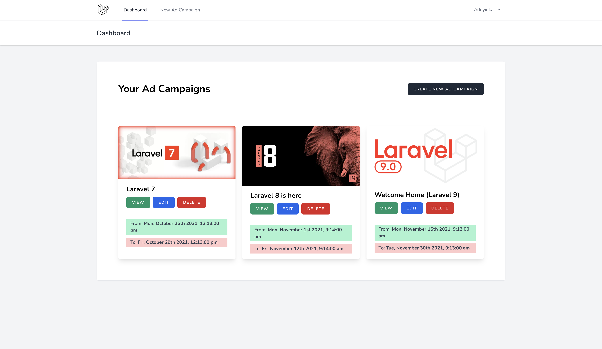

# Eskimi Advertising Campaign


## Technical Details
- The application was built using the following:
  - PHP 8
  - Laravel 8.*
  - [Laravel Sail](https://laravel.com/docs/8.x/sail) - CLI for Docker development environment.
  - Laravel Breeze with Inertiajs (+ Vue) - for simple authentication scaffolding.
  - Vue.js for frontend.
  - Cache driver defaults to file. However, the development setup allows to use `memcached` which is recommended.
- Authentication is done only on the UI. Can be extended to APIs though, but that was not a core requirement.
- APIs are used for the managing the advertising campaigns.
- While running the application, the following operations are queued to improve speed and performance. To open the queue worker `./vendor/bin/sail artisan queue:listen`:
  - Forgot password notification.
  - Running **AdCampaignSeeder** for the banner images.

## System Requirements
- Composer
- PHP 8
- Docker

## Development Environment Setup
1. Clone the repository.
2. Install the dependencies with `composer install`
3. Run `composer run-script post-root-package-install`: To run post-install scripts.
4. Run `composer run-script post-create-project-cmd`: To run post-install scripts (application key, storage link, etc).
5. Run `./vendor/bin/sail build --no-cache`: To build the docker images.
6. Start the application **docker** service, run `./vendor/bin/sail up -d`. *The `-d` flag is to run the service in the background.*
   If you run into this error:
   > Cannot start service laravel.test: Ports are not available: listen tcp 0.0.0.0:*: bind: address already in use

   It means that your system has a service running on the specified port. To fix this without affecting anything, open your `.env` file and scroll down to uncomment the variables to configure the desired ports. Then, re-run the command.
   ```
    APP_PORT=
    FORWARD_DB_PORT=
    FORWARD_MAILHOG_PORT=
    FORWARD_MAILHOG_DASHBOARD_PORT=
   ```

   **If you do change your APP_PORT, ensure you modify your APP_URL to reflect it as well. Else, images may not display.**
7. Run the migrations with `./vendor/bin/sail artisan migrate`
8. Note: Since we are using Docker to setup, you can modify `CACHE_DRIVER=memcached` in your `.env` file.**
9. Open your browser and visit: http://127.0.0.1:_APP_PORT_

## Tests
`sail artisan test`

